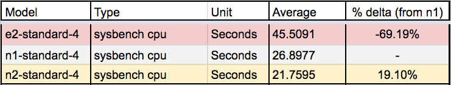
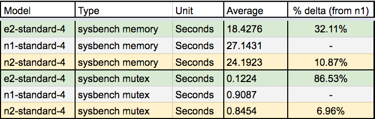
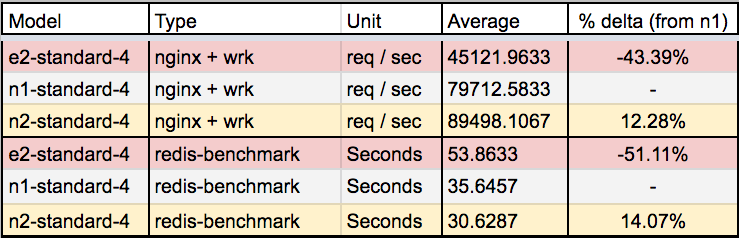

# GCP E2 instance benchmark

A much more detailed analaysis is covered at: < insert blog article here >

---

The following benchmarks command and results, was performed in `us-central1-f` region. Using `N1/N2/E2-standard-4` instances. With `N1-standard-4` serving the baseline for comparision. In addition, a seperate `N2-Standard-16` was deployed to perform the HTTP wrk bench tests agains the 3 respective servers.

Bench test covers the following

- Sysbench CPU
- Sysbench Memory
- Sysbench Mutex
- Nginx + Wrk
- Redis-Benchmark

Every benchmark test is done 4 times, with the first result ignored (to serve as system warm up), `raw-data/<test-type>` contains the raw screenshots of the test results.

---

# Results Spreadsheet

- [excel file](./results-table/GCP e2_n1_n2-standard-4 benchmark.xlsx)
- [benchmark table](./results-table/1 - Benchmark.html)
- [price table](./results-table/2 - Price Table.html)
- [workload suggestions](./results-table/3 - Workload Suggestions.html)

---

# Results Highlights





---

# Sysbench based testing

```
# Sysbench Setup
sudo apt-get update
sudo apt-get install -y sysbench 

# Sysbench CPU testing
sysbench --test=cpu --cpu-max-prime=50000 --num-threads=4 run

# Sysbench Memory testing
sysbench --test=memory --num-threads=4 run

# Sysbench Thread testing
sysbench --test=threads --thread-locks=1 --max-time=20s run

# Sysbench Mutex testing
sysbench --test=mutex --num-threads=64 run
```

---

# Redis benchmarking

```
sudo apt-get install -y redis-server

time redis-benchmark -q 
```

---

# HTTP benchmarking

**For each target server**
```
sudo apt-get install -y nginx
```

**For the bench testing server**
```
sudo apt-get install -y wrk

# Test command for each server
wrk --threads 16 --connections 500 --duration 60s --latency http://<TARGET-SERVER-IP>
```

---
